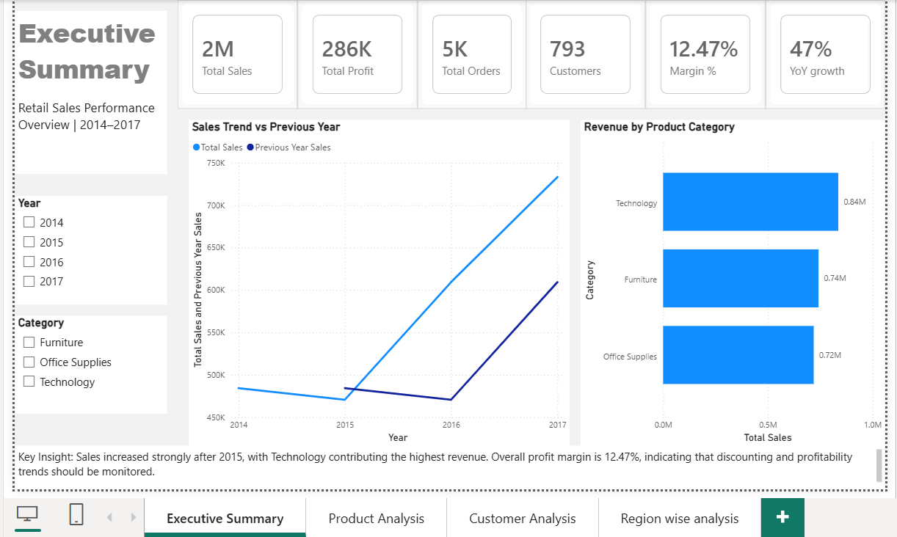
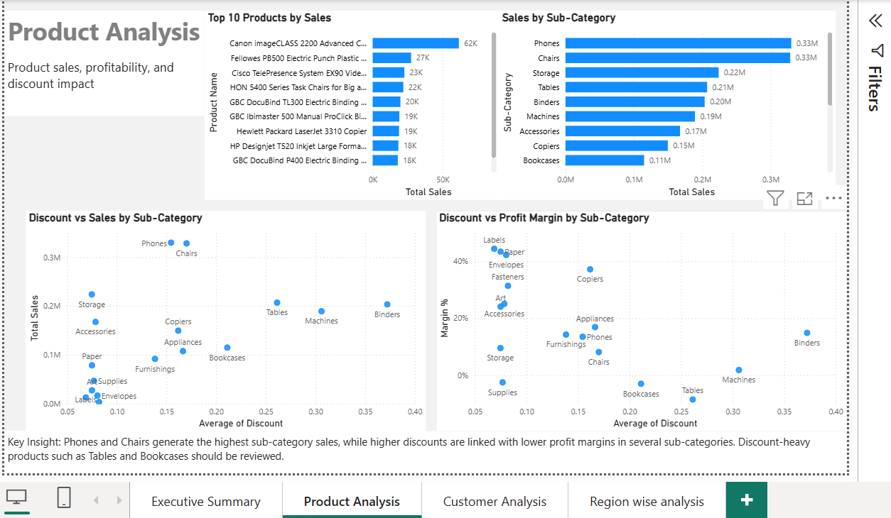
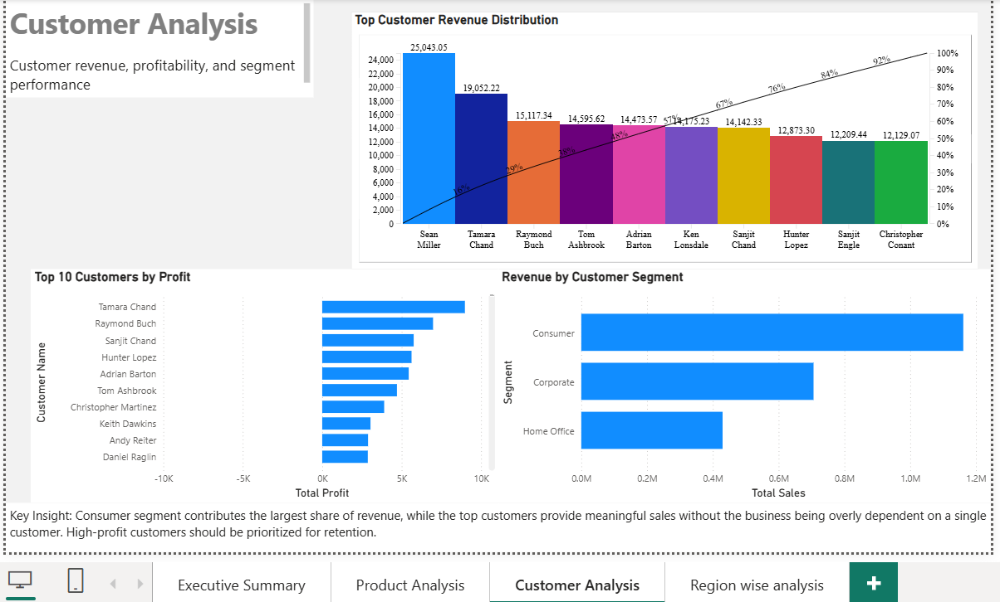
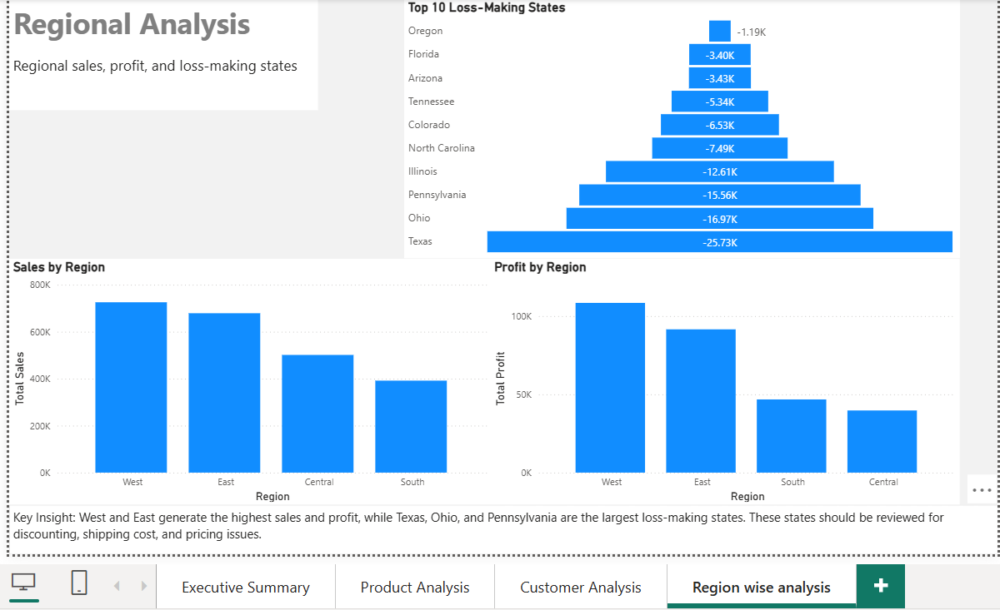
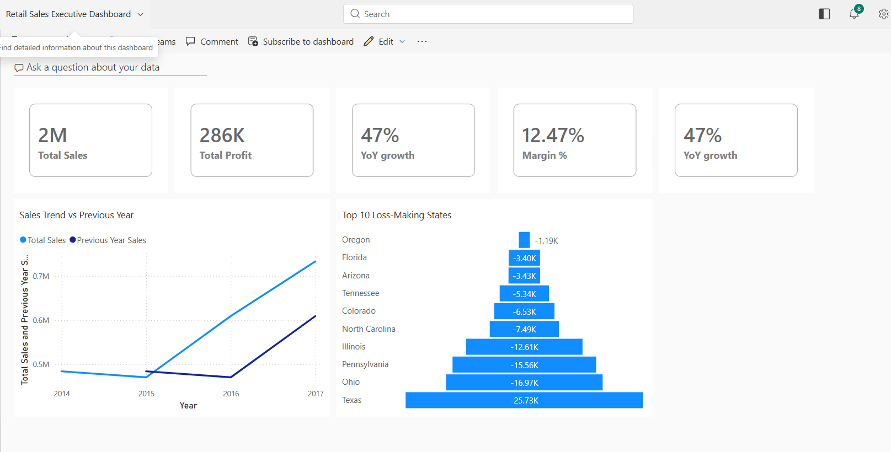

# Retail Sales Analytics Dashboard | Power BI

## Project Overview

This project is an end-to-end **Retail Sales Analytics Dashboard** built in **Power BI** using the Sample Superstore dataset. The goal of the project is to analyze business performance across sales, profit, products, customers, discounts, and regions.

The report is designed to help business stakeholders answer key questions such as:

- How is overall sales and profit performance?
- Which product categories and sub-categories drive revenue?
- Which products and states are generating losses?
- Are higher discounts reducing profitability?
- Which customer segments contribute the most revenue?
- How is current sales performance compared to the previous year?

---
## Dashboard Screenshots

### Executive Summary


### Product Analysis


### Customer Analysis


### Regional Analysis


### Power BI Service Dashboard

## Tools Used

- **Power BI Desktop**
- **Power Query**
- **DAX**
- **Power BI Service**
- **Data Modeling / Star Schema**

---

## Dataset

**Dataset:** Sample Superstore Dataset  
**Source:** Kaggle  
**Data includes:**

- Orders
- Customers
- Products
- Categories and sub-categories
- Sales
- Quantity
- Discount
- Profit
- Region, state, and city information

---

## Data Model

The original flat file was transformed into a simple star schema for better performance, scalability, and reporting clarity.

### Fact Table

**FactSales**

Contains transactional sales data:

- Row ID
- Order ID
- Order Date
- Ship Date
- Ship Mode
- Customer ID
- Product ID
- Region
- State
- City
- Sales
- Quantity
- Discount
- Profit

### Dimension Tables

**DimCustomer**

- Customer ID
- Customer Name
- Segment

**DimProduct**

- Product ID
- Product Name
- Category
- Sub-Category

**DimDate**

- Date
- Year
- Quarter
- Month Name
- Month Number

### Relationships

- `DimCustomer[Customer ID]` → `FactSales[Customer ID]`
- `DimProduct[Product ID]` → `FactSales[Product ID]`
- `DimDate[Date]` → `FactSales[Order Date]`

All relationships follow a **one-to-many** structure from dimension tables to the fact table.

---

## Key DAX Measures

```DAX
Total Sales = SUM(FactSales[Sales])
```

```DAX
Total Profit = SUM(FactSales[Profit])
```

```DAX
Total Quantity = SUM(FactSales[Quantity])
```

```DAX
Total Orders = DISTINCTCOUNT(FactSales[Order ID])
```

```DAX
Total Customers = COUNTROWS(DimCustomer)
```

```DAX
Profit Margin % = DIVIDE([Total Profit], [Total Sales])
```

```DAX
Previous Year Sales =
CALCULATE(
    [Total Sales],
    SAMEPERIODLASTYEAR(DimDate[Date])
)
```

```DAX
YoY Sales Difference =
IF(
    ISBLANK([Previous Year Sales]),
    BLANK(),
    [Total Sales] - [Previous Year Sales]
)
```

```DAX
YoY Growth % =
DIVIDE([YoY Sales Difference], [Previous Year Sales])
```

---

## Report Pages

### 1. Executive Summary

Provides a high-level view of overall business performance.

Key visuals:

- Total Sales
- Total Profit
- Total Orders
- Total Customers
- Profit Margin %
- YoY Growth %
- Sales Trend vs Previous Year
- Revenue by Product Category

### 2. Product Analysis

Analyzes product and sub-category performance.

Key visuals:

- Top 10 Products by Sales
- Sales by Sub-Category
- Discount vs Sales by Sub-Category
- Discount vs Profit Margin by Sub-Category

### 3. Customer Analysis

Focuses on customer revenue, profitability, and customer segment contribution.

Key visuals:

- Top Customers by Profit
- Revenue by Customer Segment
- Customer Revenue Distribution / Pareto Analysis

### 4. Regional Analysis

Identifies regional sales and profit performance.

Key visuals:

- Sales by Region
- Profit by Region
- Top 10 Loss-Making States

---

## Key Business Insights

- Sales increased strongly after 2015, showing positive business growth.
- Technology contributed the highest revenue among product categories.
- Overall profit margin was around 12%, indicating profitability but also room for improvement.
- Higher discounts were associated with lower profit margins across several sub-categories.
- Consumer segment contributed the largest share of revenue.
- Some states, including Texas, Ohio, and Pennsylvania, generated significant losses and require further review.
- Loss-making states may need investigation into discounting, shipping costs, and pricing strategy.

---

## Business Recommendations

- Review discount strategy for low-margin and loss-making products.
- Focus marketing investment on high-sales and high-profit product categories.
- Investigate loss-making states to identify pricing, shipping, or discount issues.
- Prioritize customer retention strategies for high-profit customers.
- Monitor YoY Growth and Profit Margin regularly through the executive dashboard.

---

## Power BI Service Dashboard

A Power BI Service dashboard was created by pinning key executive visuals from the report, including:

- Total Sales
- Total Profit
- Profit Margin %
- YoY Growth %
- Sales Trend vs Previous Year
- Revenue by Product Category
- Top 10 Loss-Making States

This provides a single-page executive snapshot for quick decision-making.

---

## Skills Demonstrated

- Data cleaning using Power Query
- Building a star schema data model
- Creating relationships with correct cardinality
- Writing DAX measures
- Time intelligence using `SAMEPERIODLASTYEAR`
- KPI design
- Customer, product, and regional analysis
- Discount impact analysis
- Power BI report design
- Power BI Service publishing and dashboard creation

---

## Project Files

The repository includes:

- Power BI PBIX file
- Dashboard screenshots
- README documentation

---

## Author

**Vishal Surwase**  
Microsoft Certified: Power BI Data Analyst Associate
